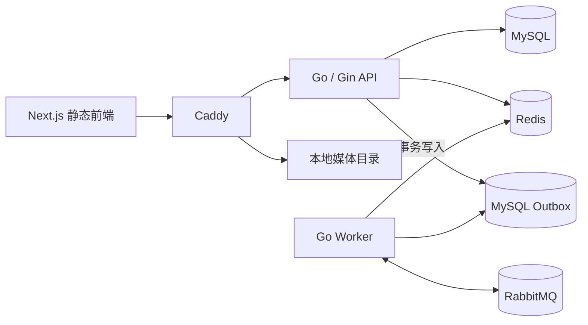

# 架构与一致性

## 表与索引

- `users` 的用户名唯一；`invites` 的邀请码哈希唯一，事务内加锁兑换；`sessions` 保存 Refresh Token 哈希和撤销状态。
- `videos` 按作者/发布时间、发布时间、点赞数及热度建立索引；`video_tags` 的视频/话题组合唯一。
- `likes`、`follows` 使用唯一组合索引；评论、私信和通知按查询方向建立索引。
- `outboxes` 与 `processed_events` 组成事务性 Outbox 和消费去重链路。

GORM 在启动时迁移表结构。涉及删列或数据转换的正式变更应先提交显式迁移和恢复方案。

## 缓存与 Feed

- Redis Lua 脚本把计数增加和首次设置过期时间合并为原子操作，用于登录、注册限流。
- 视频详情缓存 TTL 为 5 分钟；互动写入后删除对应缓存。Redis 不可用时详情仍可从 MySQL 读取。
- Worker 根据 MySQL 的最终计数更新 `feed:hot` 和 `feed:latest` ZSET。Feed API 排序和游标以 MySQL 查询为准，保证缓存重建时仍可浏览；后续流量增长可把 ZSET 用作首屏候选索引。
- 最新/关注按 ID 降序分页，热度/点赞按 `(分数, ID)` 复合游标分页。榜单更新可能改变后续内容。

## 消息与并发

发布、点赞、评论、关注的业务更新与 Outbox 事件在同一个 MySQL 事务中提交。Worker 以固定数量的 goroutine 消费 RabbitMQ，并用 channel、context 取消与优雅退出控制生命周期。发布方等待 Broker Confirm 后标记 Outbox 已发布。消费者手动 Ack，失败进入延迟重试队列，超过次数进入死信队列。`processed_events` 唯一键保证通知写入幂等。

通知先落 MySQL，再由 Redis Pub/Sub 提示 SSE 连接刷新；SSE 瞬断时历史通知仍可读取。上传分片先落临时目录并校验分片和整文件 MD5，发布后移动到公开媒体目录。数据库和媒体需要一起备份。
